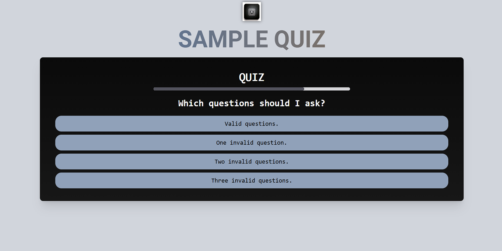

# Basic Quiz App

Documentation for customizing this application can be found in the [docs directory](docs/index.md).

## References
- [Get started with Tailwind CSS](https://tailwindcss.com/docs/installation/using-vite)
- [React](https://react.dev/)
- [Configuring Jest](https://jestjs.io/docs/configuration)
- [Using TypeScript with Jest](https://jestjs.io/docs/getting-started#using-typescript)
- [React Router](https://reactrouter.com/en/main)
- [Effortless Testing Setup for React with Vite, TypeScript, Jest, and React Testing Library 2025](https://dev.to/teyim/effortless-testing-setup-for-react-with-vite-typescript-jest-and-react-testing-library-1c48)